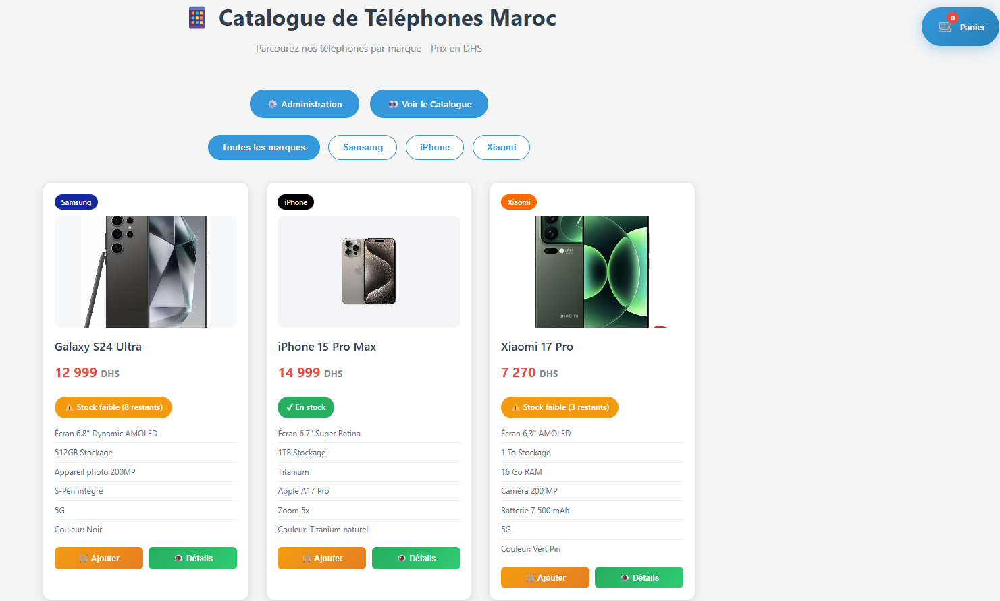
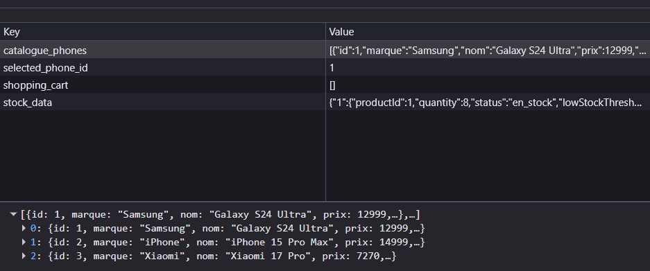
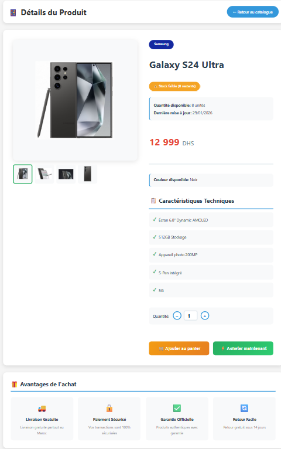
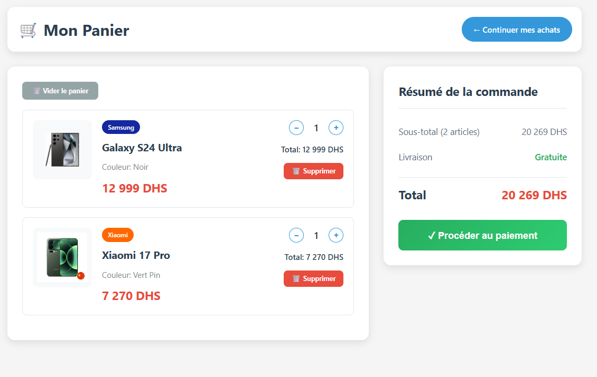
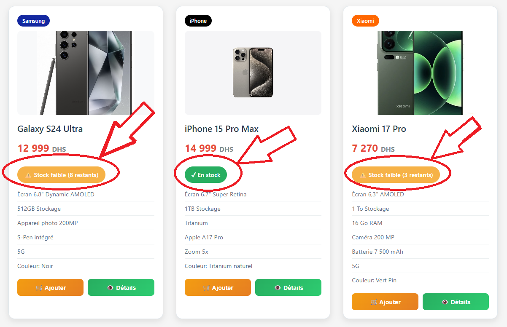

# Custom E-commerce Storefront Cart System

This e-commerce application delivers a highly responsive and scalable frontend experience built entirely with HTML, CSS, and JavaScript. To manage data without a backend server, the project utilizes a local mock API powered by JavaScript and the browser's localStorage. This client-side database seamlessly stores and feeds information to the intuitive product grid and detailed product pages, which are further enhanced by interactive image galleries featuring custom zoom functionality. At the core of the application is a robust, dynamic shopping cart engine that handles real-time price calculations and item management. By querying the localStorage database, the cart deeply integrates with a complex inventory tracking mechanism, actively monitoring product availability across four distinct states—Available, Low Stock, Out of Stock, and Unavailable—to ensure accurate stock representation and a frictionless shopping journey.

## Project Structure
```text
Custom-E-commerce-Storefront-Cart-System/
├── index.html        # Main storefront and product grid
├── details.html      # Detailed product pages with zoom galleries
├── panier.html       # Dynamic shopping cart interface
├── stock-api.js      # Local mock API & localStorage database engine
└── README.md         # Project documentation
```

## Core Features

- **Responsive Frontend**: Built entirely with HTML, CSS, and JavaScript.
  <br>
  

- **Local Mock API**: Utilizes `localStorage` as a client-side database, bypassing the need for a backend server.
  <br>
  

- **Interactive Galleries**: Features custom image zoom functionality on detailed product pages.
  <br>
  

- **Dynamic Shopping Cart**: Engine that handles real-time price calculations and item management.
  <br>
  

- **Inventory Tracking**: Monitors product availability across four distinct states (Available, Low Stock, Out of Stock, Unavailable).
  <br>
  

## How to Run
1. **Clone the repository** (or download the source code).
2. **Launch the application**:
   Simply double-click and open `index.html` in any modern web browser. No external dependencies or backend server installations are required.

---
*Created as part of the Custom E-commerce Storefront Cart System project.*
